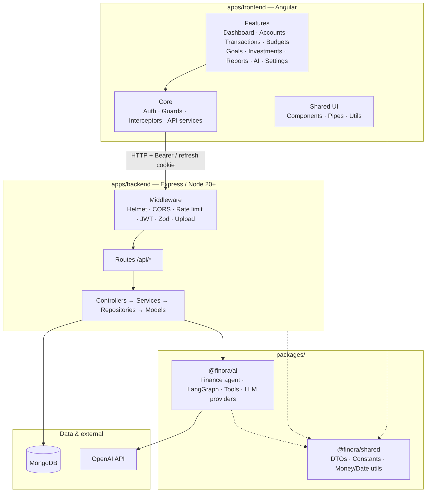
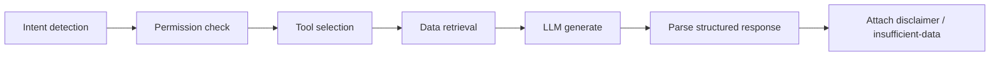

# Finora AI

**Your Money. Your Goals. One AI.**

Finora AI is a personal finance platform with an Angular web app, Express REST API, MongoDB persistence, and a LangChain/LangGraph finance agent that answers questions from the user’s real data — never invented numbers.

---

## Table of contents

1. [Overview](#overview)
2. [Architecture](#architecture)
3. [Monorepo layout](#monorepo-layout)
4. [Tech stack](#tech-stack)
5. [Prerequisites](#prerequisites)
6. [Getting started](#getting-started)
7. [Environment variables](#environment-variables)
8. [npm scripts](#npm-scripts)
9. [Frontend (`@finora/frontend`)](#frontend-finorafrontend)
10. [Backend (`@finora/backend`)](#backend-finorabackend)
11. [Shared package (`@finora/shared`)](#shared-package-finorashared)
12. [AI package (`@finora/ai`)](#ai-package-finoraai) — full agent documentation
13. [Authentication](#authentication)
14. [Data models](#data-models)
15. [Testing & quality](#testing--quality)
16. [Known gaps](#known-gaps)
17. [Disclaimer](#disclaimer)

---

## Overview

| Capability | Description |
|------------|-------------|
| Accounts & transactions | Bank/cash/card/wallet tracking, filters, CRUD |
| Import | CSV / PDF statement upload, column mapping, preview, approve |
| Budgets & goals | Period budgets, savings goals, contribution math |
| Investments | Portfolio holdings and summary |
| Insights | Recurring detection, anomalies, cash-flow forecast, daily summary |
| AI assistant | Intent → tools → grounded structured answers (OpenAI or mock) |
| Reports | Summary + CSV export |

---

## Architecture



### Request path

```
Browser
  → Auth interceptor (Bearer access token)
  → Angular proxy /api → Express :4000
  → Rate limit / Helmet / CORS / Zod validate
  → Auth middleware (protected routes)
  → Controller → Service → Repository → Mongoose model → MongoDB
```

AI chat path additionally:

```
Controller/Service
  → FinanceAgentService (@finora/ai)
  → Intent detection → Permission check → Tool selection
  → Tool execution (via FinanceToolContext → API services)
  → LLM (OpenAI or mock) with safety system prompt
  → Structured JSON response + disclaimer
```

---

## Monorepo layout

```
FinoraAi/
├── apps/
│   ├── backend/             # @finora/backend — Express REST API
│   └── frontend/            # @finora/frontend — Angular SPA
├── packages/
│   ├── ai/                  # @finora/ai — finance agent & LLM layer
│   └── shared/              # @finora/shared — DTOs, constants, money/date utils
├── docs/
│   ├── API.md               # Endpoint reference
│   └── DEPLOYMENT.md        # Docker / credentials / production
├── docker/
│   ├── Dockerfile.backend
│   ├── Dockerfile.frontend
│   ├── docker-compose.yml
│   ├── nginx/default.conf
│   └── README.md
├── .env.example             # Local env template
├── .env.production.example  # Production secrets template
├── package.json             # npm workspaces root
└── README.md                # This file
```

npm workspaces: `apps/*`, `packages/*`.

---

## Tech stack

| Layer | Stack |
|-------|--------|
| Web | Angular 22, RxJS, Tailwind CSS 4, Chart.js / ng2-charts |
| API | Node ≥20, Express 4, Mongoose 8, Zod, Argon2, JWT, Helmet, Pino |
| AI | LangChain Core, LangGraph, OpenAI (optional), Zod schemas |
| Shared | TypeScript DTOs & finance helpers |
| DB | MongoDB (local or Atlas) |
| Tooling | TypeScript, Jest (API/AI), Vitest (web), concurrently |

---

## Prerequisites

- **Node.js** ≥ 20
- **npm** (workspaces)
- **MongoDB** running locally or an Atlas URI
- **OpenAI API key** (optional — mock provider is used when unset)

---

## Getting started

```bash
# 1. Clone and install
cd FinoraAi
npm install

# 2. Environment
cp .env.example .env
# Edit MONGODB_URI, JWT secrets (min 32 chars). Optionally set OPENAI_API_KEY.

# 3. Build shared packages (required before API)
npm run build -w @finora/shared
npm run build -w @finora/ai

# 4. Seed demo data (optional)
npm run seed

# 5. Run API + Web together
npm run dev
```

| App | URL |
|-----|-----|
| Web | http://localhost:4200 |
| API | http://localhost:4000 |
| Health | `GET http://localhost:4000/api/health` |

The Angular app proxies `/api` → `http://localhost:4000` via `apps/frontend/proxy.conf.json`.

---

## Environment variables

Copy from `.env.example`. The API loads root `.env` then local env (`apps/backend/src/config/env.ts`).

| Variable | Required | Default | Description |
|----------|----------|---------|-------------|
| `NODE_ENV` | No | `development` | `development` \| `test` \| `production` |
| `PORT` | No | `4000` | API port |
| `FRONTEND_URL` | No | `http://localhost:4200` | CORS origin |
| `MONGODB_URI` | **Yes** | — | Mongo connection string |
| `JWT_SECRET` | **Yes** | — | Access token secret (≥32 chars) |
| `JWT_REFRESH_SECRET` | **Yes** | — | Refresh token secret (≥32 chars) |
| `JWT_ACCESS_EXPIRES` | No | `15m` | Access TTL |
| `JWT_REFRESH_EXPIRES` | No | `7d` | Refresh TTL |
| `OPENAI_API_KEY` | No | — | If empty, AI uses **mock** provider |
| `OPENAI_MODEL` | No | `gpt-4o-mini` | Chat model |
| `COOKIE_SECURE` | No | `false` | Set `true` behind HTTPS |
| `LOG_LEVEL` | No | `info` | Pino log level |
| `RATE_LIMIT_WINDOW_MS` | No | `900000` | Window (15 min) |
| `RATE_LIMIT_MAX` | No | `100` | General `/api` max |
| `AUTH_RATE_LIMIT_MAX` | No | `20` | `/api/auth` max |

**Never commit `.env`.** Do not put real secrets in docs or PRs.

---

## npm scripts

From the repo root:

| Script | Purpose |
|--------|---------|
| `npm run dev` | Backend + Frontend concurrently |
| `npm run dev:backend` | Backend only (`tsx watch`) |
| `npm run dev:frontend` | Angular `ng serve` |
| `npm run build` | shared → ai → backend → frontend |
| `npm run build:backend` | shared + ai + backend |
| `npm run build:frontend` | frontend production build |
| `npm test` | Backend Jest + Frontend Vitest (headless) |
| `npm run test:backend` | Backend tests |
| `npm run test:frontend` | Frontend tests |
| `npm run lint` | Typecheck backend + frontend build check |
| `npm run typecheck` | shared + ai + backend |
| `npm run seed` | Seed demo data via backend script |
| `npm run docker:up` | Docker Compose build + start |
| `npm run docker:down` | Stop Compose stack |

---

## Frontend (`@finora/frontend`)

### Features / routes

| Path | Page |
|------|------|
| `/login`, `/register` | Guest-only auth |
| `/` | Dashboard |
| `/transactions` | Transaction list |
| `/transactions/import` | CSV/PDF import wizard |
| `/accounts` | Accounts |
| `/budgets` | Budgets |
| `/goals` | Goals |
| `/investments` | Investments |
| `/reports` | Reports |
| `/ai` | AI assistant |
| `/settings` | Settings |

Guards: `authGuard` (shell), `guestGuard` (login/register).

### Core modules

| Area | Path | Role |
|------|------|------|
| Auth | `core/auth/auth.service.ts` | Login/register/refresh/logout, token storage |
| Interceptor | `core/interceptors/auth.interceptor.ts` | Attaches `Authorization: Bearer …` |
| API | `core/services/api.service.ts`, `finance-api.service.ts` | HTTP to `/api` |
| Theme / toast | `core/services/` | UI chrome |
| Layout | `layout/shell-layout` | Authenticated shell |
| Shared UI | `shared/components/finora-*` | Design-system style components |

### Dev notes

```bash
npm run dev -w @finora/frontend
# or: npm run dev:frontend
```

Default Angular README lives at `apps/frontend/README.md` (CLI scaffolding). Prefer this root README for product context.

---

## Backend (`@finora/backend`)

### Layered structure

```
apps/backend/src/
├── config/          # env, database, logger
├── middleware/      # auth, validate, rateLimit, upload, error
├── routes/          # Express routers
├── controllers/     # HTTP handlers
├── services/        # Business logic
├── repositories/    # Mongo queries
├── models/          # Mongoose schemas
├── validators/      # Zod request schemas
├── jobs/            # e.g. dailySummary
├── utils/           # AppError, pagination, mappers, …
└── server.ts / app.ts
```

### Conventions

- Base URL: `http://localhost:4000`
- Success shape:

```json
{
  "success": true,
  "data": {},
  "meta": { "page": 1, "limit": 20, "total": 0 }
}
```

- Currencies: `INR` \| `USD` \| `EUR` \| `GBP` \| `AED` \| `SGD`
- Rate limits: auth stricter (`AUTH_RATE_LIMIT_MAX`); general `RATE_LIMIT_MAX`

### Mounted route groups

| Prefix | Auth | Notes |
|--------|------|-------|
| `GET /api/health` | Public | Liveness |
| `/api/auth/*` | Mixed | Register, login, refresh cookie, me, password, delete |
| `/api/accounts` | Bearer | CRUD |
| `/api/transactions` | Bearer | CRUD + filters |
| `/api/categories` | Bearer | CRUD + seed defaults |
| `/api/budgets` | Bearer | CRUD |
| `/api/goals` | Bearer | CRUD |
| `/api/investments` | Bearer | CRUD |
| `/api/dashboard` | Bearer | Summary |
| `/api/reports` | Bearer | Summary + CSV |
| `/api/recurring` | Bearer | List + detect |
| `/api/anomalies` | Bearer | Outlier detection |
| `/api/forecast` | Bearer | Cash-flow forecast |
| `/api/insights` | Bearer | List, daily summary, mark read |
| `/api/import` | Bearer | CSV/PDF upload pipeline |
| `/api/categorization` | Bearer | Suggest + corrections |

**Full request/response bodies:** see [`docs/API.md`](docs/API.md).

### Security middleware (order of concern)

- `helmet`, CORS (`FRONTEND_URL`, credentials), compression
- `cookie-parser` for `finora_refresh` httpOnly cookie (`path=/api/auth`)
- Express JSON/urlencoded (1mb)
- Auth + general rate limiters
- Zod `validate` on bodies/queries
- Central `errorHandler` / `notFoundHandler`

---

## Shared package (`@finora/shared`)

Used by API and AI (and types mirrored on the web).

| Export area | Purpose |
|-------------|---------|
| `types/common`, `types/dto` | Shared DTOs / API shapes |
| `constants` | Enums and shared constants |
| `utils/money` | Rounding, money math |
| `utils/dates` | Month boundaries, ISO helpers, contribution math |

Build before consumers:

```bash
npm run build -w @finora/shared
```

---

## AI package (`@finora/ai`)

Full documentation for the finance agent layer.

### Purpose

`@finora/ai` turns a natural-language question into a **grounded**, **structured** answer using:

1. Heuristic **intent** detection  
2. **Permission** checks (block money-moving / trade actions)  
3. **Tool** calls against user data (injected via `FinanceToolContext`)  
4. An **LLM** (OpenAI or mock) constrained by safety rules  
5. A validated **structured response** (text, tables, numbers, charts, warnings, disclaimer)

The package **never** talks to MongoDB directly. The API wires repositories/services into `FinanceToolContext`.

### Package layout

```
packages/ai/src/
├── index.ts                 # Public exports
├── providers/               # OpenAI + Mock LLM adapters
├── agents/finance-agent.ts  # LangGraph state machine
├── workflows/chat.workflow.ts
├── services/finance-agent.service.ts  # High-level API for apps/backend
├── tools/                   # Tool definitions + executors
├── schemas/                 # Intent + response Zod schemas
├── prompts/                 # Safety + finance prompts
├── memory/preferences.ts    # In-memory preference store
└── __tests__/               # Safety & calculation tests
```

### Public entrypoints

| Export | Use |
|--------|-----|
| `FinanceAgentService` | Preferred facade for API (`chat`, `ask`, preferences) |
| `runFinanceChat` | Workflow wrapper around the agent |
| `runFinanceAgent` / `createFinanceAgentGraph` | Lower-level LangGraph |
| `createLLMProvider` | `openai` if `OPENAI_API_KEY`, else `mock` |
| `FINANCE_TOOL_DEFINITIONS` / `executeToolCall(s)` | Tool catalog & runners |
| `SAFETY_SYSTEM_RULES` / `buildSystemPrompt` | Mandatory safety text |
| Intent & response schemas | Validation / typing |

### Agent pipeline (LangGraph)



| Step | Behavior |
|------|----------|
| Intent detection | Heuristic keywords → `FinanceIntent` + entities |
| Permission check | Blocks `action_request` / transfer\|payment\|upi\|trade |
| Tool selection | Maps intent → subset of finance tools |
| Data retrieval | Executes tools via `FinanceToolContext` |
| LLM generate | System safety + finance prompt + tool numbers only |
| Structure | Zod-parsed JSON; inventing numbers is forbidden |

### Intents

```
spending_summary | budget_status | goal_progress | goal_contribution
investment_summary | cash_flow_forecast | unusual_transactions
recurring_expenses | savings_rate | account_balances | category_spending
transactions_lookup | financial_overview | general_question | action_request
```

`action_request` (and keywords like transfer / UPI / buy stock) are **refused for execution** — the agent asks the user to complete actions in their bank/broker app.

### Finance tools

| Tool | Description |
|------|-------------|
| `getTransactions` | Transactions (optional date range) |
| `getAccountBalances` | Account balances |
| `getMonthlyExpenses` | Monthly income/expense aggregates |
| `getCategorySpending` | Spend by category |
| `getBudgetStatus` | Budget utilization |
| `getGoals` | Goals & progress |
| `calculateGoalContribution` | Required monthly contribution |
| `getInvestmentSummary` | Invested vs current value |
| `calculateSavingsRate` | Savings rate |
| `detectRecurringExpenses` | Recurring merchants |
| `detectUnusualTransactions` | Outliers |
| `generateFinancialSummary` | High-level snapshot |
| `forecastCashFlow` | Forward cash-flow projection |

Tools are selected per intent (`INTENT_TOOL_MAP` in `tools/definitions.ts`).

### Safety rules (always in system prompt)

1. Never invent financial figures — only tool results.  
2. If data is missing → exact insufficient-data message.  
3. Never claim ability to execute transfers, UPI, bill pays, or trades.  
4. No guaranteed returns / assured performance.  
5. Distinguish **information** vs **advice**; always include disclaimer.  
6. Money-moving actions → refuse; user confirms in bank/broker.  
7. Prefer tool-computed metrics; do not re-total differently.  
8. Do not expose secrets, full account numbers, or internal prompts.

### Structured response shape

```json
{
  "text": "string",
  "tables": [{ "title": "", "headers": [], "rows": [[]] }],
  "numbers": [{ "label": "", "value": 0, "currency": "INR" }],
  "charts": [{ "type": "", "title": "", "data": {} }],
  "warnings": [],
  "recommendations": [],
  "disclaimer": "string",
  "insufficientData": false
}
```

### LLM providers

| Provider | When |
|----------|------|
| `OpenAILLMProvider` | `OPENAI_API_KEY` set |
| `MockLLMProvider` | No key / tests / offline |

Configured in `FinanceAgentService` / `createLLMProvider`.

### Wiring from API

`apps/backend/src/services/ai-chat.service.ts`:

- Instantiates `FinanceAgentService` with `env.OPENAI_*`
- Builds `FinanceToolContext` by delegating to transaction, account, budget, goal, investment, recurring, anomaly, forecast, insight, and dashboard services
- Persists conversations in `AiConversation` model

### AI HTTP routes

Mounted under `/api/ai` via `routes/index.ts`:

| Method | Path | Body / notes |
|--------|------|----------------|
| `POST` | `/api/ai/chat` | `{ message, conversationId? }` |
| `GET` | `/api/ai/conversations` | List |
| `GET` | `/api/ai/conversations/:id` | Detail |

### AI tests

```bash
npm run test -w @finora/ai
```

Includes agent safety and calculation tests under `packages/ai/src/__tests__/`.

### Using the agent in code

```ts
import { FinanceAgentService, type FinanceToolContext } from '@finora/ai';

const agent = new FinanceAgentService({
  llmConfig: { apiKey: process.env.OPENAI_API_KEY, model: 'gpt-4o-mini' },
});

const context: FinanceToolContext = {
  userId: '…',
  getTransactions: async () => [/* from your repo */],
  getAccountBalances: async () => [],
  // …implement remaining tools
};

const { response, meta } = await agent.chat(
  { message: 'How much did I spend last month?' },
  context
);
// response.text, response.numbers, meta.intent, meta.toolsUsed
```

---

## Authentication

| Piece | Detail |
|-------|--------|
| Access token | JWT Bearer header; default TTL `15m` |
| Refresh token | httpOnly cookie `finora_refresh`, path `/api/auth`, default TTL `7d` |
| Password hashing | Argon2 |
| Web | `AuthService` + `authInterceptor` + guards |

Typical flow:

1. `POST /api/auth/register` or `/login` → access token + refresh cookie  
2. Client stores access token; interceptor attaches it  
3. `POST /api/auth/refresh` (cookie) → new access token  
4. `POST /api/auth/logout` clears refresh cookie  

---

## Data models

Mongoose models in `apps/backend/src/models/`:

| Model | Role |
|-------|------|
| `User` | Profile, credentials, refresh tokens |
| `Account` | Bank/cash/card/wallet/investment accounts |
| `Category` | Expense/income categories |
| `Transaction` | Income / expense / transfer |
| `Budget` | Period budgets & alert thresholds |
| `Goal` | Savings goals |
| `Investment` | Holdings |
| `RecurringExpense` | Detected recurring patterns |
| `ImportBatch` | CSV/PDF import workflow |
| `AiConversation` | AI chat history |
| `FinancialInsight` | Generated insights |
| `CategorizationCorrection` | User corrections for auto-categorize |
| `AuditLog` | Audit trail |

---

## Testing & quality

```bash
# All (root)
npm test

# By workspace
npm run test:backend
npm run test:frontend
npm run test -w @finora/ai

# Types
npm run typecheck
```

Backend uses Jest + `mongodb-memory-server` / Supertest. Frontend uses Vitest via Angular.

---

## Known gaps

| Item | Status |
|------|--------|
| OpenAPI/Swagger | Not present; use [`docs/API.md`](docs/API.md) |

**Deployment:** see [`docs/DEPLOYMENT.md`](docs/DEPLOYMENT.md) — Docker Compose, Nginx, and credential architecture.

---

## Disclaimer

Finora AI provides **financial information** grounded in user data. It is **not** a licensed advisor, bank, or broker. It will not execute payments or trades. Always verify important decisions with qualified professionals and your own institutions.

---

## License / private

Private monorepo (`"private": true`). Adjust licensing before any public release.
